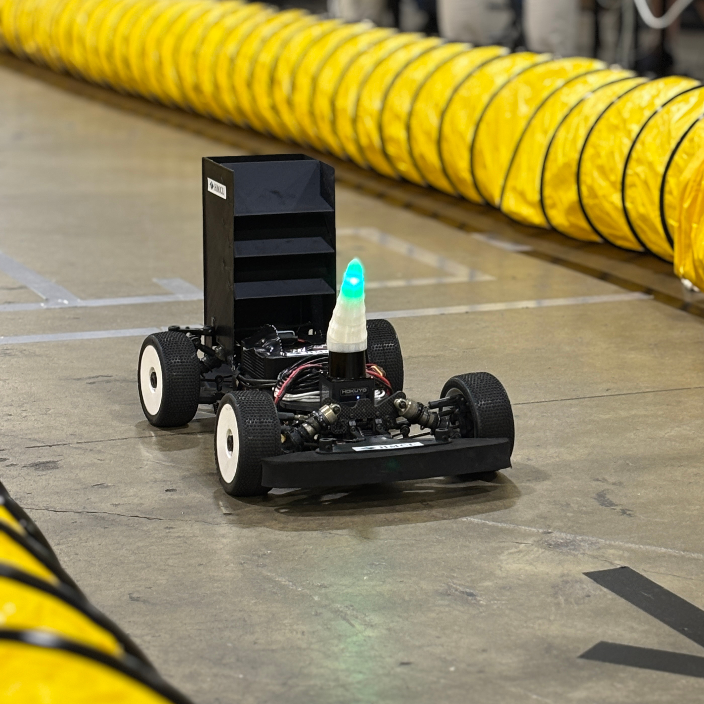
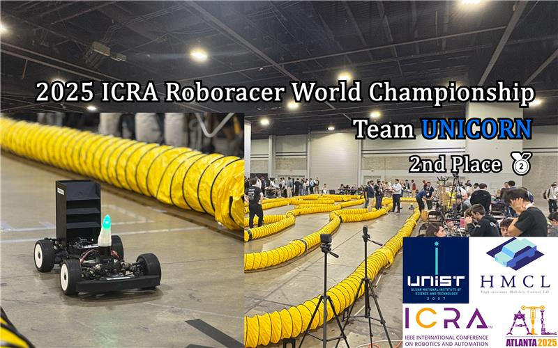

# UNICORN Autonomous Racing Stack

This repository introduces the race stack of the **Unicorn team**, which won `2nd place` at **The 24th Roborace Autonomous Grand Prix Competition** held at ICRA 2025 in Atlanta, USA.

Check our Race highlight on Youtube!:

**Note:** Click on the thumbnails to watch the videos.

## Installation
We provide an race stack installation guide.\
[INSTALLATION.md](./INSTALLATION.md).\
Also, you must read this file carefully.\
[READYTORUN.md](./READYTORUN.md).
## Getting started

After installation, the car (or the simulation environment) is ready to be tested. For examples on how to run the different modules on the car, refer to the [`stack_master` README](./stack_master/README.md). 

## Acknowledgement
This project would not be possible without the use of multiple great open-sourced code bases as listed below:
This project benefited greatly from the open-sourced code provided by [ForzaETH](https://github.com/ForzaETH/race_stack), 
particularly in areas ranging from installation methods to the overall autonomous racing architecture. We would also like to acknowledge the use of other excellent open-source projects listed below:

- [F1TENTH Racecar Simulator](https://github.com/f1tenth/f1tenth_simulator)
- [Veddar VESC Interface](https://github.com/f1tenth/vesc)
- [Cartographer](https://github.com/cartographer-project/cartographer)
- [Cartographer ROS Integration](https://github.com/cartographer-project/cartographer_ros)
- [global_racetrajectory_optimization](https://github.com/TUMFTM/global_racetrajectory_optimization)
