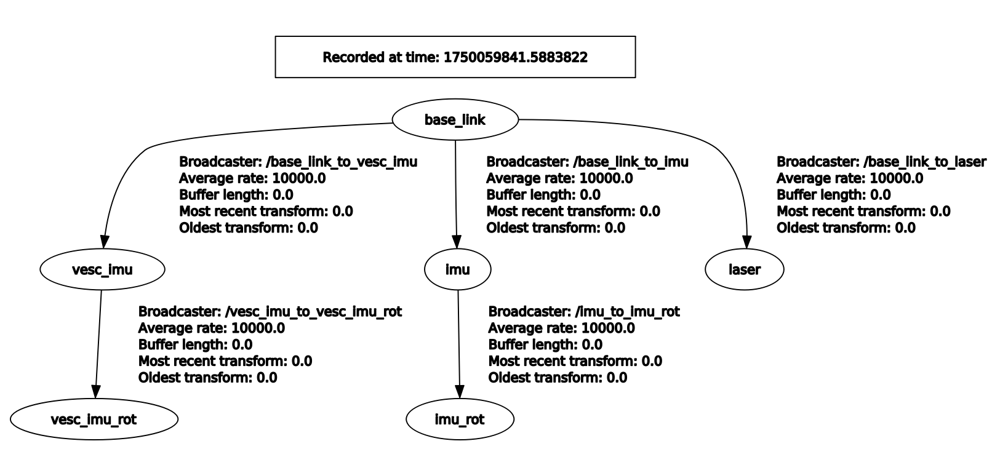
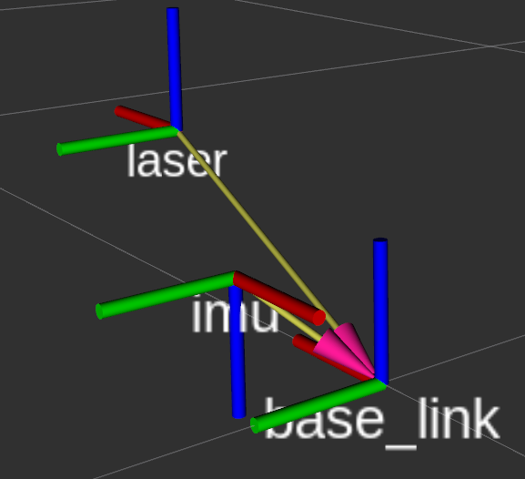
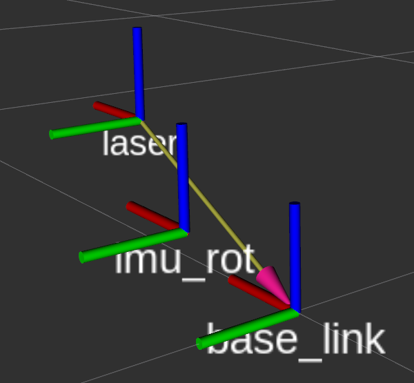
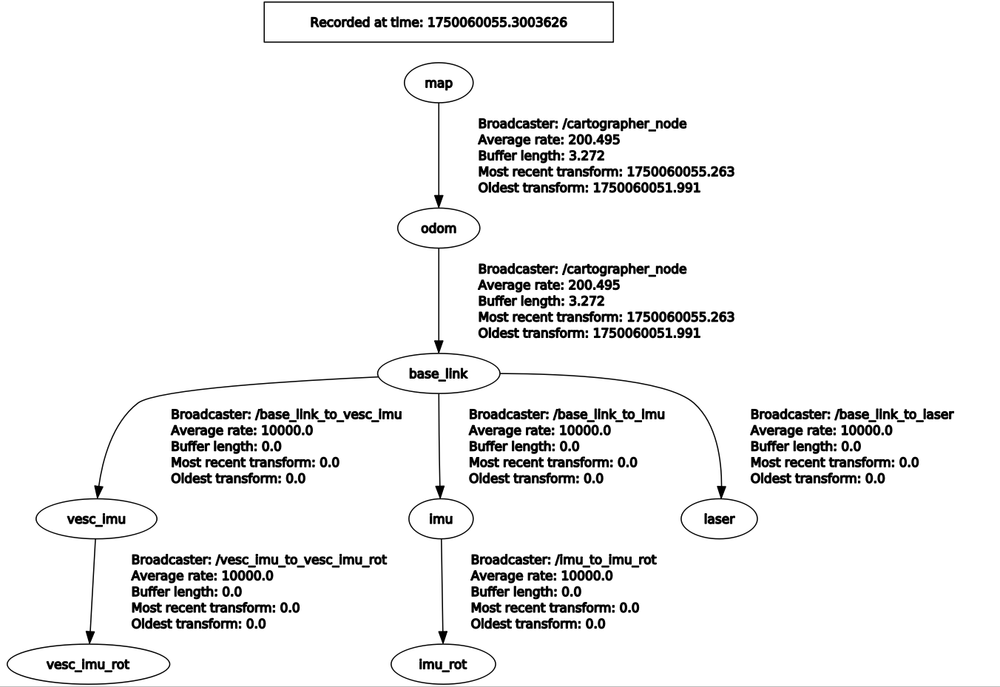

# READY TO RUN
## TF configuration(Important!!)

<a>
  
</a>

1. Define the static transforms between `base_link` and each sensor **first**, just like in the following file:\
[static_transforms.xml](./stack_master/config/SRX1/devices/static_transforms.launch.xml)
2. Measure and publish the correct transformation between the `base_link` (center of the rear wheels) and your sensors.

3. If your IMU reports data in a frame where the **Z-axis points toward the Earth's center**:

   * You should **physically flip the IMU**,
   * **Or**, publish an intermediate TF frame that rotates the IMU's Z-axis upward without any translation.

   Example:

   ```xml
   <node pkg="tf2_ros" type="static_transform_publisher" name="base_link_to_vesc_imu" 
         args="0.10 0.0 0.127 0.0 0.0 -0.7071 0.7071 base_link vesc_imu" />
   <node pkg="tf2_ros" type="static_transform_publisher" name="vesc_imu_to_vesc_imu_rot" 
         args="0.0 0.0 0.0 0.0 0.0 0.7071 0.7071 vesc_imu vesc_imu_rot" />
   ```
<a>
  
</a><a>
  
</a>


4. If you're using your **own wheel odometry**, make sure it **does not** publish TF.

5. Since `publish_to_tf` is set to `true` in Cartographer `.lua` config, the transform between `map` and the `published_frame` in '.lua' config  will be published automatically.


This in a result tf tree.
Take carefully see the broadcaster.

<a>
  
</a>

## Cartographer Tuning Based on LiDAR Specs

Current configuration is optimized for a **30m LiDAR**. Adjust accordingly if you're using a different range sensor.

---

## Accurate `erpm_gain` and `servo_gain` Calibration

Because your **wheel odometry** is used as an input to Cartographer, **accurate tuning** of `erpm_gain` and `servo_gain` is critical.

1. The current `adaptive_wheel_odom` node needs to be well-tuned to reflect your vehicle’s actual movement.

---

## Hardware Setup is Crucial

Just like localization is low-level and critical, hardware is even **more** foundational.

* **Your LiDAR must be perfectly level.**
  This means correcting both **pitch** and **roll**.

* A good way to check roll:
  In a straight section, keep the car stationary and verify that both left and right sides of the LiDAR field of view reach the same distance.

* If your car experiences rapid acceleration, you may **slightly tilt** the LiDAR **downward** (adjust pitch) to help localization.

* If your track mainly runs **clockwise (CW)** or **counter-clockwise (CCW)**, a **slight roll adjustment** in the corresponding direction can improve localization.
  (However, note that this might affect control performance.)

---

## Slip Driving

If your controller causes the vehicle to **drift or slide**, do **not** use wheel odometry as an input to Cartographer.
Use only sensor-based inputs like LiDAR and IMU.

---

## READY TO RACE

If your localization remains **stable** even during **aggressive maneuvers** like those seen in real-world autonomous racing,
🎉 you’re officially ready to start building your **Autonomous Racing stack**!