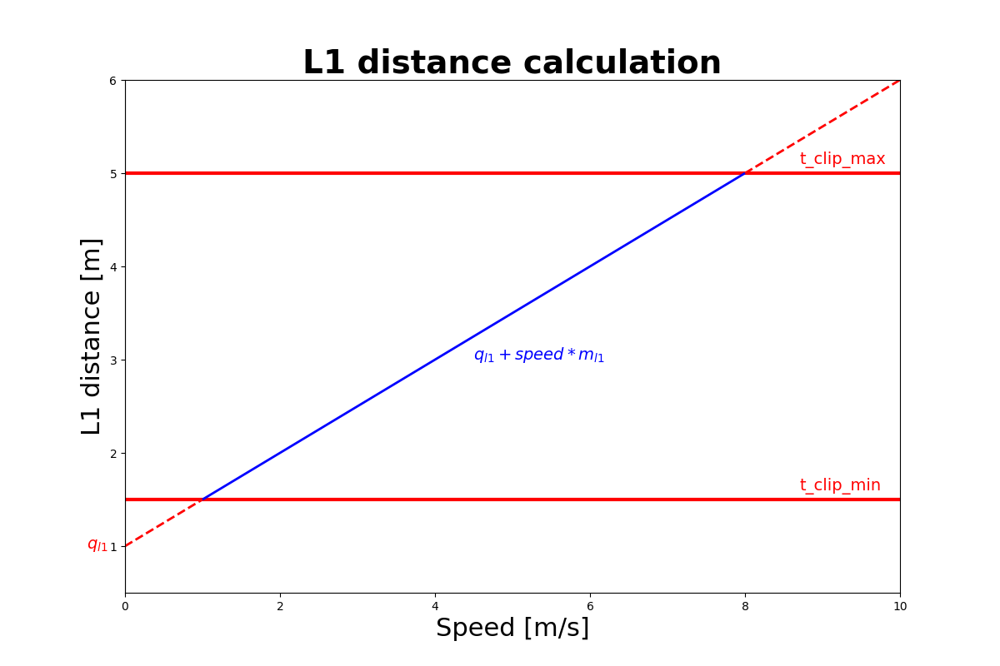

# Combined Controller for Pure-Pursuit Controller and Model- and Acceleration-based Pursuit Controller
The Combined Controller is a configurable control module that supports both a Pure Pursuit Controller (PPC) and a Model- and Acceleration-based Pursuit Controller (MAP), based on the method proposed in [Model- and Acceleration-based Pursuit Controller for High-Performance Autonomous Racing](https://arxiv.org/pdf/2209.04346.pdf). The active control mode can be selected via the ctrl_algo parameter, allowing flexible adaptation to different racing strategies or track conditions. The controller is managed and configured through the `controller_manager.py` node.

## Longitudinal controller
The speed from the global optimizer is propagated to compensate for the delay and scaled according to the lateral error, heading error, and the curvature of the waypoints.

`<parameter_name>`: description [minimum, maximum, tuned]

- `speed_lookahead`: Lookahead time in seconds to account for actuation and computation delay. [0, ∞, 0.25]
- `lat_err_coeff`: How much of the lateral error is taken into account to smoothly rejoin the trajectory. Higher values increase the dependence of the lateral error on the speed reduction. [0, 1, 1]
- `heading_error_thres`: Threshold for the heading error (in degrees) above which speed is reduced. [0.0,  30.0, 10.0]
- `speed_factor_for_lat_err`: Weighting factor that determines how much lateral error affects speed reduction. [0.0, 5.0, 1.0]
- `speed_factor_for_curvature`: Weighting factor that determines how much path curvature affects speed reduction. [0.0, 5.0, 1.0]

### Trailing Controller

- `trailing_gap`: reference gap to the to-be-trailed opponent in meters. [0, ∞, 1.5] 
* `trailing_vel_gain`: Gain factor that determines how the trailing gap (in meters or seconds) is adjusted based on velocity. \[0.0, 2.0, 0.25]
- `trailing_p_gain`: P-Gain of trailing controller. [0, ∞, 1]
- `trailing_i_gain`: I-Gain of trailing controller. [0, ∞, 0]
- `trailing_d_gain`: D-Gain of trailing controller. [0, ∞, 0.2]
- `blind_trailing_speed`: Minimal Trailing speed when opponent not in line-of-sight. [0, ∞, 1.5]

## Lateral controller
It uses L1-based trajectory tracking, which can be configured to follow either a classical geometric Pure Pursuit method or the model- and acceleration-aware variant described in [Model- and Acceleration-based Pursuit Controller for High-Performance Autonomous Racing](https://arxiv.org/abs/2209.04346). 

Depending on the selected mode, the controller either computes steering angles directly from geometric relations or via lateral acceleration lookup.
To ensure stable performance at high speeds and on tight curves, the lookahead distance is scaled based on delay-compensated velocity.
During fast acceleration (> 1 m/s²) or strong deceleration (< -3 m/s²), steering gain is also adjusted accordingly to improve stability.

- `m_l1`: Proportional term for the affine mapping of the velocity to the lookahead distance. [0, ∞, 0.6] 
- `q_l1`: Offset term for the affine mapping of the velocity to the lookahead distance. [−∞, ∞, -0.18]
- `curvature_factor`: Scales the lookahead distance based on path curvature. [0, 5, 2.5]
- `t_clip_min`: clipping value for minimal L1 distance. [0, ∞, 0.8]
- `t_clip_max`: clipping value for maximal L1 distance. [0, ∞, 5]
- `future_constant`: Time offset used to estimate the vehicle's future position for trajectory tracking. [0.0, 1.0, 0.1]
- `KP`: P gain used for heading error correction. \[0.0, 5.0, 0.2]
- `KI`: I gain used for heading error correction. \[0.0, 5.0, 0.0]
- `KD`: D gain used for heading error correction. \[0.0, 5.0, 0.01]
- `speed_diff_thres`: Threshold to control how fast the vehicle converges to the desired speed in START mode. \[0.0, 6.0, 0.5]
- `start_speed`: Target speed for the START state. \[0.0, 15.0, 6.0]
- `start_curvature_factor`: curvature factor for L1 distance calculation for START state. \[0.0, 10.0, 1.5]
- `AEB_thres`: Lateral error threshold for Autonomous Emergency Braking (AEB). \[0.0, 1.0, 0.2]

At high speeds the steering is downscaled by a factor to reduce tire slipping 
- `start_scale_speed`: start of downscaling speed range. [0, ∞, 7]
- `end_scale_speed`: end of downscaling speed range. [0, ∞, 8]
- `downscale_factor`: percent of steer downscaling. [0, 100, 20]

- `acc_scaler_for_steer`: when accelerating stronger than 1m/s^2 the steering is increased by this factor. [1, ∞, 1.2]
- `dec_scaler_for_steer`: when accelerating stronger than -3m/s^2 the steering is reduced by this factor. [0, 1, 0.9]
- `speed_lookahead_for_steer`: Lookahead time in seconds propagate velocity, for steering lookup. Can increase laptime by cutting more corners. [0, 0.2, 0]
- `steer_gain_for_speed`: Gain factor that adjusts steering magnitude according to vehicle speed. \[0.0, 5.0, 1.25]

## Usage

We recommend using the launch files provided in the `stack_master` package.