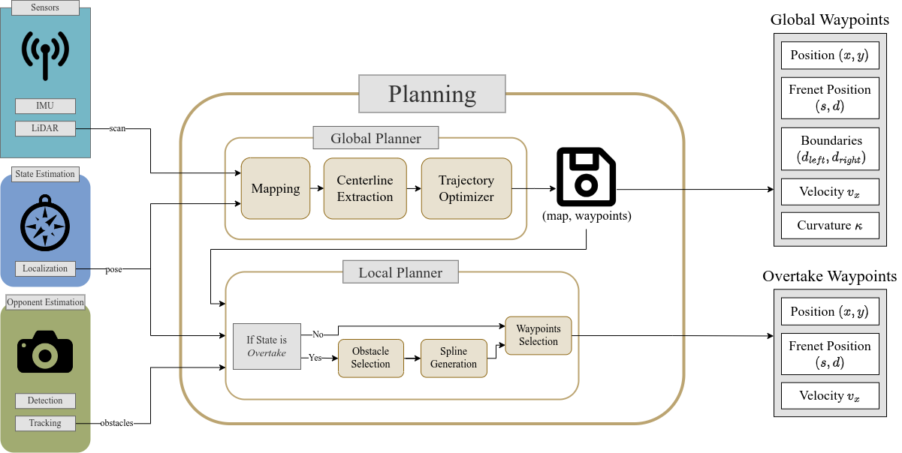

# Planner

This directory contains the local planning system (i.e. overtaking and collision avoidance) and the global planning system (minimum curvature trajectory generation) of F110 at the PBL group

## Global Planner
- [`gb_optimizer`](./gb_optimizer)

## Local Planner
- [`lane_change_planner`](./lane_change_planner/README.md)
- [`spliner_planner`](./spliner_planner/README.md)
- [`sqp_planner`](./sqp_planner/README.md)
- [`recovery_planner`](./recovery_planner/README.md)
- [`spliner`](./sqp_planner/README.md)
