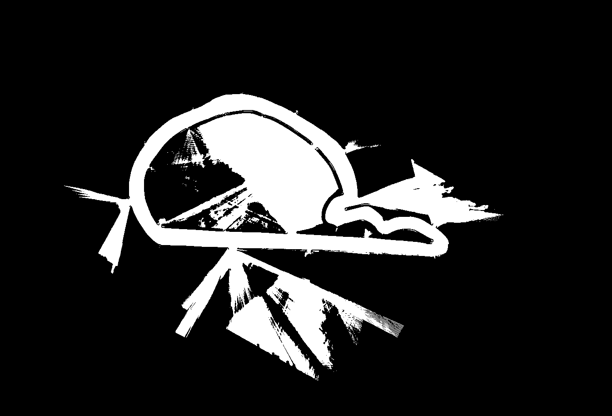
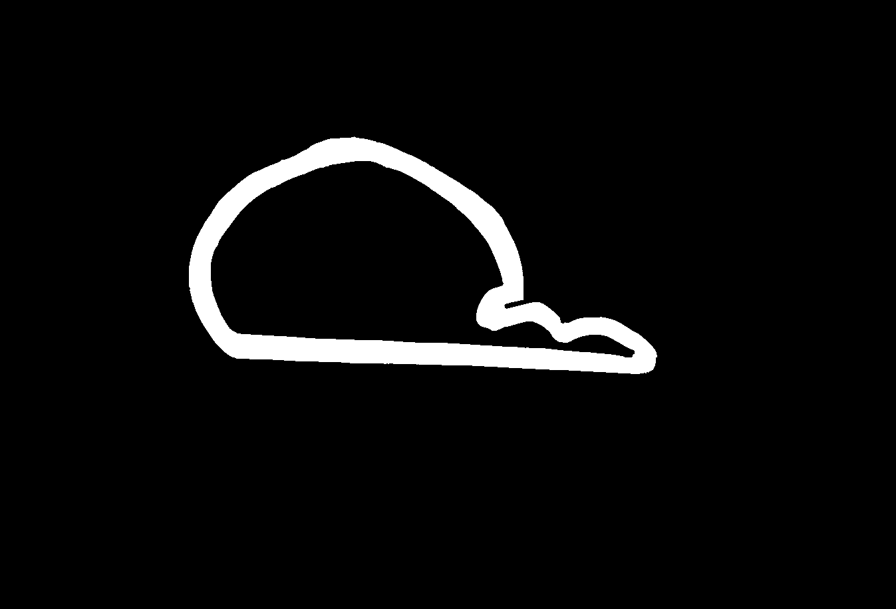

# Stack Master
Here is the `stack_master`, it is intended to be the main interface between the user and the PBL F110 system.

## Basic Usage
Here, you can find instructions on how to run the vehicle modules, along with brief explanations of the role each module plays.

## Mapping (on the real car)
### How To Launch Mapping
It is suggested to first launch a roscore in a separate terminal. This will be useful to keep any RViz sessions working even across restarts of the base system.
```shell
roscore
```

Then launch the mapping procedure with the following launch file. This includes the execution of low-level components such as the VESC, LiDAR, and IMU:
```shell
roslaunch stack_master mapping.launch map:=<map name of choice> racecar_version:=<SRX1>
```

  - `<map name of choice>` can be any name with no white space. Conventionally we use the location name (eg, 'hall', 'icra') followed by the full date (month and day). For instance, `icra`.
  - `<SRX1>` depends on which car you are using. SRX1, FIESTA1, etc.

After completing a lap, press `y` and `Enter` to save the mapping results. After the results are saved, the Optimal Global Trajectory will be automatically calculated. Then, two GUI windows will appear, each containing a slider that can be used to select the sectors.

After both the standard sectors and the overtaking sectors are chosen, the mapping procedure will re-build the `sector_tuner` and the `overtaking_sector_tuner` package, and then a2ter this is completed the procedure can be ended with Ctrl+C.

You will then need to re-source the ROS environment, which can be done as:
```shell
source /opt/ros/noetic/setup.bash && source ~/catkin_ws/devel/setup.bash
```

### ⚠️ Cautions During Mapping
  - By default, `VESC odometry` is used during mapping. If you are operating the vehicle for the first time, please adjust the [vesc.yaml](./config/SRX1/devices/vesc.yaml) file to ensure accurate VESC odometry.

  - When driving the vehicle for mapping, `try to follow the center line` of the track as closely as possible. Failure to do so may result in errors during global path generation.

  - If the vehicle is driven at high speed during mapping, the map may not be generated correctly. It is recommended to `perform mapping at a low speed` for better accuracy.

  - If there are `gaps` between the walls that make up the track, resulting in an unclear mapping output as shown in the bottom-left image, it is necessary to `refine the created map`. You need to use image editing tools to clearly define the map and track areas as seen on the bottom right. FYI, we used **GIMP** for map editing.

    - Mainly used map is the `<map name of choice>.png` file. Therefore, download and edit the generated pf_map.png or `<map name of choice>.png`, then replace it with the edited `<map name of choice>.png`.You can find the map files in [maps folder](./maps/icra_0512)

<a>
  
</a> 
<a>
  
</a>

### Additional Arguments for Mapping

If you want to generate only the map again, or generate only the global path after refining the map, refer to the following arguments.

  - If you add `create_global_path:=false`, only mapping will be performed without selecting sectors, and no path will be generated.

  - If you add `create_map:=false`, mapping will be skipped, and it will generate a global path based on `map:=<map name of choice>`  after selecting sectors.


## Base_System
### How To Launch Base_System

The base system launches the low-level system and the state estimation necessary for the head-to-head algorithm to operate:

```shell
roslaunch stack_master base_system.launch map:=<map name of choice> racecar_version:=NUCX
```

  - `<map name of choice>` You can use the map name that was set during the previous mapping process. If you want to use a map you've obtained in the past, you can select and use one from the maps available in [maps folder](./maps).
  - `<NUCX>` depends on which car you are using. NUC2, JET1, etc.

### Additional Arguments for Base_system

  - By adding `sim:=true`, you can run the algorithm in a `simulation environment` using the map you selected. This is useful for testing perception, planning, and control modules.

  - you can use the `algo:=` argument to select and run a specific localization algorithm. By default, it is set to use only Cartographer, but other available options can be found in the [launchfile](./launch/base_system.launch).

    For more details on the Cartographer being used, see [here](../state_estimation/README.md).

## Headtohead
### How To Launch Headtohead

The headtohead launches the perception, planning, state machine, and control nodes for the head-to-head race:

```shell
roslaunch stack_master headtohead.launch 
```

### Additional Arguments for Headtohead

  - **Controller**: There are two controller algorithms available: `Pure Pursuit` and `MAP`. By default, the **Pure Pursuit** algorithm is selected. You can switch to the MAP algorithm by adding the argument `ctrl_algo:=MAP`.

    - If you choose to use the `MAP algorithm`, a lookup table that reflects the tire and road surface conditions is required. You can load the appropriate lookup table file using the `LU_table:=<lookup table name>` argument.

    - For instructions on `how to generate a lookup table`, please refer to [sys_id](../sys_id). todo

    - For more detailed information about the `Controller` module, please refer to [Controller](../controller/README.md). 
  
  - **Perception**: If you `do not want` to run the `Perception` module, add the argument `perception:=false`

    - For more detailed information about the `perception` module, please refer to the [perception](../perception/README.md). 

  - **State machine & planner**: For more detailed information about the state machine or the planner, please refer to the [state machine](../state_machine/README.md) and [planner](../planner/README.md).

## Low_level
### How To Launch Low_level
The low_level launches the most fundamental components of the vehicle, including VESC, LiDAR, IMU, and the joy node. This launch file is included in the [base_system.launch](./launch/base_system.launch) file, but if you want to run only the low-level module, you can use this launch file independently.

```shell
roslaunch stack_master low_level.launch 
```

### Additional Arguments for Low_level

Since we used a joystick controller receiver together to minimize issues caused by Wi-Fi, the joy node is set to run together when low_level is launched.
If you want to `run the joy node` on a `separate PC`, please **comment out** the following part in the [launch file](./launch/low_level.launch).

```shell
# Remove or comment out to disable joy node
<node pkg="joy" type="joy_node" name="joy_node" output="screen"/>
```

## Sys_id
### How To Launch Sys_id

`sys_id` launches the **on_track_sys_id** which assists in `generating the lookup table` required for using MAP with the controller.
While the vehicle is driving on the track, on_track_sys_id `estimates tire parameters` based on the collected data. Using these parameters, it calculates the steering angle corresponding to the vehicle's current speed and lateral acceleration, and saves the results in a `lookup table` format.
This lookup table is then loaded by the `MAP controller` and used for steering angle computation.

```shell
roslaunch stack_master sys_id.launch 
```
### Additional Arguments for Sys_id
  - The `save_LUT_name` and `racecar_version` arguments specify the naming used when saving the lookup table.
    - racecar_version refers to the folder name under the here directory, while save_LUT_name specifies the name of the CSV file.For convenience, it is recommended to set save_LUT_name and racecar_version to the same value.
  
  - For more detailed information about the `system_identification` module, please refer to the [system_identification](../system_identification/README.md).

---
[Go back to the main README](../README.md)