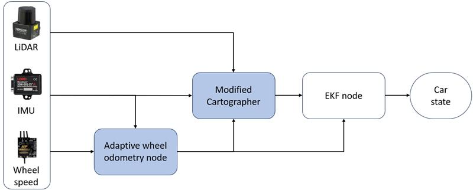

# Cartographer_unicorn

## Description
**State Estimation** in UNICORN repository is designed to provide robust and accurate pose estimation specifically tailored for high-speed 2D racing environments. 
### Modified cartographer

It is a modified version of the Cartographer SLAM framework, optimized to handle the unique challenges of rapid motion dynamics and fast-changing surroundings. The two main differences from the original Cartographer are as follows:

* **Exclusion of Odometry Data from Pose Graph Optimization**
  * In our setup, we use LiDAR, IMU, and wheel odometry data.
  * In high-speed racing, rapid acceleration and deceleration events occur frequently.
  * Therefore, additional information is required to accurately track abrupt motions.
  * In Cartographer, the IMU is primarily used for estimating the direction of gravity and extracting angular velocity.(not use linear acceleration for velocity estimation)
  * In addition, in 2D racing, the roll and pitch uncertainties make it difficult to reliably use the linear acceleration data from the IMU for the additional information of abrupt motions.
  * As a result, wheel odometry becomes the only reliable source of information for detecting such aggressive maneuvers.
  * While Cartographer uses wheel odometry as both a velocity reference and an input for pose graph optimization (PGO),
    the accuracy of wheel odometry is often insufficient for optimization due to varying reliability under different traction conditions.
  * Therefore, we have excluded wheel odometry from the pose graph optimization input to improve robustness.
  * **By removing wheel odometry from the PGO, we observed a *substantial improvement in localization stability and overall performance*** in high-speed scenarios.

* **Pose Publisher for `base_link` Frame Using `PoseWithCovarianceStamped` Message Type**

  * Cartographer’s output does not include velocity information.
  * To enable velocity estimation using the `robot_localization` package,
    we added a publisher that outputs pose data in the `base_link` frame using the `PoseWithCovarianceStamped` message type.

For more details on parameter tuning, you can refer the parameter stduy file:\
📄 [`parameter_study_en.md`](./cartographer_unicorn/parameter_study_en.md)

### Adaptive wheel odometery node
While we were able to obtain a reliable velocity reference and maintain robustness during high-speed driving, **one critical challenge** remained.

In low-traction conditions, wheel slip caused significant discrepancies between the wheel odometry and the actual vehicle velocity.
To address this, we introduced a model based on the assumption that there exists a linear relationship between the slip and the vehicle’s linear acceleration along the heading direction.
This assumption enabled us to significantly improve velocity estimation performance under challenging traction conditions.\
\
You can check this modifictions, at the follwing files:\
📄 [`adaptive_vesc_to_odom.cpp`](../sensors/vesc/vesc_ackermann/src/adaptive_vesc_to_odom.cpp)

## License

TODO
